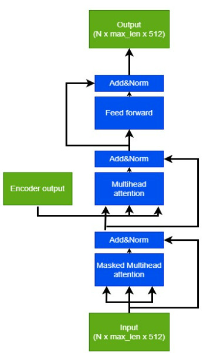

# Overview
Image captioning is the task of generating textual descriptions for images. It combines computer vision and natural language processing to teach machines to understand and describe visual content. Challenges include accurate content understanding, generating fluent language, aligning image features with language, and handling ambiguity. Despite these challenges, image captioning finds applications in accessibility, content retrieval, tagging, and enhancing user experiences.

# Used technologies
Modeling : 

This project combines two cutting-edge technologies: EfficientNet and Transformers. 

EfficientNet, a CNN architecture, specializes in extracting informative features from images efficiently. Utilizing EfficientNet helps minimize computational costs while maximizing feature extraction performance, contributing to the overall efficiency of the image captioning process.

Transformers is a groundbreaking architecture introduced in the paper "Attention is All You Need," published in 2017 by Google's research team. Its emergence has sparked a powerful revolution in the field of artificial intelligence, particularly in natural language processing. I firmly believe that leveraging the Transformer architecture will significantly enhance the performance of our project. 

Deploying:

Hugging Face is a leading platform for natural language processing (NLP) that offers a comprehensive library of pre-trained models, datasets, and tools. It simplifies and accelerates NLP development with its user-friendly interface and extensive community support. Through Hugging Face, developers can easily access state-of-the-art NLP models, fine-tune them for specific tasks, and deploy them in production environments.

You can access the project demo here [demo](https://huggingface.co/spaces/windy2612/ImageCaptioning).

## [1].Dataset
Project uses flickr8k dataset. The project uses the Flickr8k dataset. This is a dataset consisting of over 8000 images, with each image having 5 sample captions.

You can access the dataset from [here](https://www.kaggle.com/datasets/adityajn105/flickr8k)

## [2].Model architecture

The model architecture is inspired by the Transformers architecture, consisting of two parts: an encoder and a decoder.

### [2.1].Encoder

The ImageEmbedding block uses the EfficientNet model to extract data from images. Using EfficientNet reduces computational costs.The output of ImageEmbedding wil feed to EncoderLayer as input.

Each EncoderLayer integrates a MultiheadAttention network, Add&Norm, and FeedForward. The encoder consists of multiple stacked EncoderLayers, where the output of one layer becomes the input to the next.

Finally, the output of the encoder is a tensor used as input for the decoder block.

### [2.2].Decoder

The CaptionEmbeding block is tasked embedding the captions. 
It not only embeds the words in the caption but also combines positional embeddings of the words in the caption to ensure that words further apart have smaller correlation.The output of CaptionEmbedding wil feed to DecoderLayer as input.

The decoder layer consists of three blocks: (MaskedMultiheadAttention + AddNorm), (MultiheadAttention + AddNorm), and (Feedforward + AddNorm).

Step 1: The first input is passed through the MaskedMultiheadAttention block for "self-attention". Using a mask ensures that words in the sentence can only "pay attention" to words before them. The output of the masked multihead attention is then passed through AddNorm for normalization.

Step 2: The output from step 1 is then inputted into the MultiheadAttention block to perform "cross-attention" with the encoder output. The tensor after "cross-attention" is then passed through AddNorm.

Step 3: The output from step 2 is passed through the Feedforward block to transform the logic, and then passed through AddNorm again.

Finally, we obtain a tensor that can be passed to the next DecoderLayer block or to the classifier block for classification.

## [3].Demo
After training, the model achieved an accuracy of 74.83% on the train dataset and 72.86% on the valid dataset. This is considered a fairly good result.

Below are some demos of the model:

