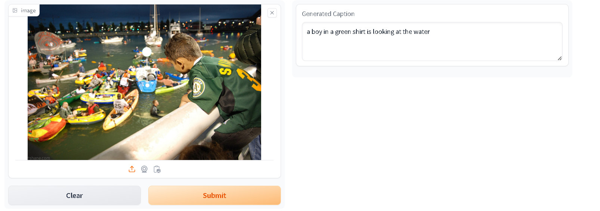

# Project name
Image Captiong with Transformers

## Overview
My project focuses on image captioning, aiming to automatically generate descriptive captions for images using deep learning techniques. By combining computer vision with natural language processing, we strive to bridge the gap between visual content and textual descriptions.

You can access demo [here](https://huggingface.co/spaces/windy2612/ImageCaptioning)
## Code structure

-`Save/Weight` : Directory containing weight of pretrained model.

-`Save/text_data.npy` : Directory contain the caption.

-`Save/vocabulary.npy` : Directory contain the words that uses to predict caption.

-`app.py` : Script for deploy model.

-`make_dataset.py` : Script generate dataset.

-`model.py` : Script for define model architecture.

-`predict.py` : Script for generate caption for new images.

-`training.py` : Script for training.

## Dataset
Project uses flickr8k dataset. The project uses the Flickr8k dataset. This is a dataset consisting of over 8000 images, with each image having 5 sample captions.

You can access the dataset from [here](https://www.kaggle.com/datasets/adityajn105/flickr8k)

## Model architecture

The model architecture is inspired by the Transformers architecture, consisting of two parts: an encoder and a decoder.

### Encoder

The ImageEmbedding block uses the EfficientNet model to extract data from images. Using EfficientNet reduces computational costs.The output of ImageEmbedding wil feed to EncoderLayer as input.

Each EncoderLayer integrates a MultiheadAttention network, Add&Norm, and FeedForward. The encoder consists of multiple stacked EncoderLayers, where the output of one layer becomes the input to the next.

Finally, the output of the encoder is a tensor used as input for the decoder block.

### Decoder

The CaptionEmbeding block is tasked embedding the captions. 
It not only embeds the words in the caption but also combines positional embeddings of the words in the caption to ensure that words further apart have smaller correlation.The output of CaptionEmbedding wil feed to DecoderLayer as input.

The decoder layer consists of three blocks: (MaskedMultiheadAttention + AddNorm), (MultiheadAttention + AddNorm), and (Feedforward + AddNorm).

Step 1: The first input is passed through the MaskedMultiheadAttention block for "self-attention". Using a mask ensures that words in the sentence can only "pay attention" to words before them. The output of the masked multihead attention is then passed through AddNorm for normalization.

Step 2: The output from step 1 is then inputted into the MultiheadAttention block to perform "cross-attention" with the encoder output. The tensor after "cross-attention" is then passed through AddNorm.

Step 3: The output from step 2 is passed through the Feedforward block to transform the logic, and then passed through AddNorm again.

Finally, we obtain a tensor that can be passed to the next DecoderLayer block or to the classifier block for classification.

## Demo

After training, the model achieved an accuracy of 74.83% on the train dataset and 72.86% on the valid dataset. This is considered a fairly good result.

Below are some demos of the model:

# Thanks for your attention.

